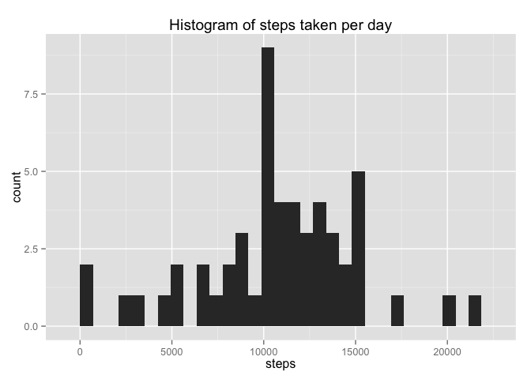
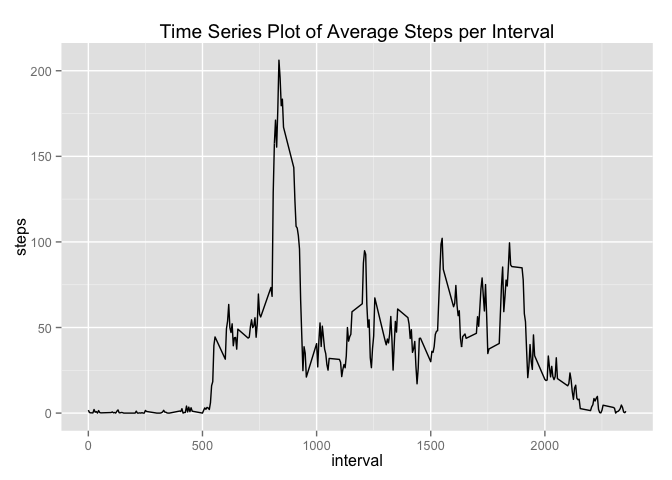
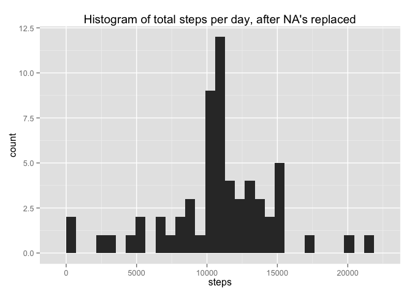
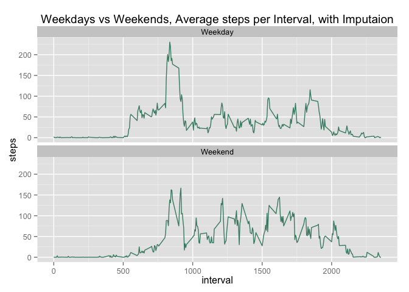

# Reproducible Research: Peer Assessment 1
P. Olsen  
11/2015  


## Loading and preprocessing the data


```r
setwd("~/Documents/datasciencecoursera/ReproducibleResearch/RepData_PeerAssessment1")
d <- read.csv("data/activity.csv")
library(dplyr)
library(plyr)
```

```
## Warning: package 'plyr' was built under R version 3.1.3
```

```r
library(lubridate)
library(ggplot2)
```

```
## Warning: package 'ggplot2' was built under R version 3.1.3
```

## What is mean total number of steps taken per day?


```r
#Calulate the sum by date
ds <- d %>% group_by(date) %>%
        summarise_each(funs(sum))

##Plot a histogram
qplot(steps, data=ds, geom="histogram", main = "Histogram of steps taken per day")
```

 

####Calculate the Mean:


```r
dmean <- mean(ds$steps, na.rm = TRUE)
## use variable in text "The mean of the sum of steps taken per day is `r dmean`."
```
The mean of the sum of steps taken per day is 1.0766189\times 10^{4}.

####Calculate the median:


```r
dmedian <- median(ds$steps, na.rm = TRUE)
## use: The median of the sum of steps taken per day is `r dmedian`.
```
The median of the sum of steps taken per day is 10765.


## What is the average daily activity pattern?

```r
d2 <- d[,c("interval", "steps")]

d2 <- d2[complete.cases(d2),]
ts <- d2 %>% group_by(interval) %>%
        summarise_each(funs(mean))

g <- ggplot(ts, aes(interval, steps)) 
g + geom_line() + ggtitle("Time Series Plot of Average Steps per Interval")
```

 

```r
## Calculate interval with the max number of steps
maxInterval <- ts[which.max(ts$steps),]["interval"]
## use variable in text: The 5-min. interval with the maximum number of steps is `r maxInterval`
```
The 5-min. interval with the maximum number of steps is 835  

## Imputing missing values


```r
## figure out how many NA's are in the data
#is na
sna <- sum(is.na(d$steps))
mna <- mean(is.na(d$steps))
## use variables in text
```
Total NA's in the data is 2304. The proportion of missing values is 0.1311475.


```r
## Impute NA's
##using this fucntion, fill in NA values with means of existing values by interval
##From Hadley Wickham: http://www.mail-archive.com/r-help@r-project.org/msg58289.html
##
impute <- function(x, fun) {
        missing <- is.na(x)
        replace(x, missing, fun(x[!missing]))
}

di <- ddply(d, ~ interval, transform, steps = impute(steps, mean))

#Calulate the sum by date
dsi <- di %>% group_by(date) %>%
        summarise_each(funs(sum))

##Plot a histogram of imputed data
qplot(steps, data=dsi, geom="histogram", main = "Histogram of total steps per day, after NA's replaced")
```

 

```r
#Calculate the mean and median by date, imputed

dmeani <- mean(dsi$steps, na.rm = TRUE)
dmediani <- median(dsi$steps, na.rm = TRUE)
# use variables in text
```

The mean of imputed data is 1.0766189\times 10^{4} vs removing NA's: 1.0766189\times 10^{4}. 
The means are the same because I used mean values to fill in the NA's.  
  
The median of imputed data is 1.0766189\times 10^{4} vs removing NA's: 10765.  

## Are there differences in activity patterns between weekdays and weekends?  


```r
## create data frame with factor for weekdays and weekends
dw <- di
dw$dayType <- factor(c("Weekend","Weekday"))

dw$dayType <- ifelse(weekdays(as.Date(dw$date)) %in% c("Sunday","Saturday"), "Weekend", "Weekday")
dw[, 'dayType'] <- as.factor(dw[, 'dayType'])

dwg <- dw %>% group_by(dayType, interval) %>% 
        summarise_each(funs(mean))

# create pannel plot
g <- ggplot(dwg, aes(interval,steps))+geom_line(color="aquamarine4")+facet_wrap(~dayType, nrow=2)
g + ggtitle("Weekdays vs Weekends, Average steps per Interval, with Imputaion")
```

 
